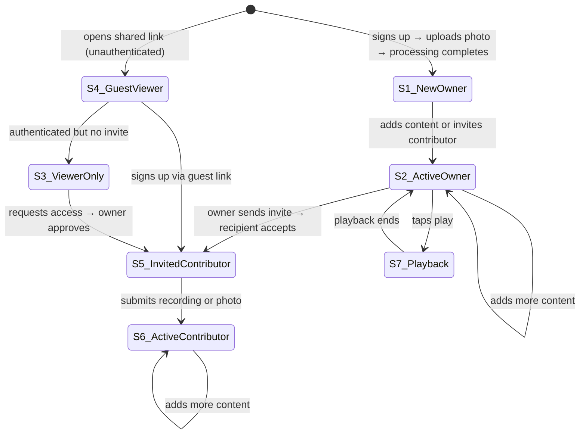

# Ember — State Map

This file is the source of truth for application state logic. It defines every state a user can be in, how transitions happen, and what data the backend must provide for each state. BEHAVIORS.md covers how the UI looks; this file covers who sees what and why.

---

## State Diagram

---

## Transition Table

Rows = current state. Columns = triggering event. Cell = next state (— means event does not apply).

| | Signs Up | Uploads Photo | Processing Done | Sends Invite | Accepts Invite | Submits Content | Requests Access | Access Granted | Taps Play | Playback Ends |
|---|---|---|---|---|---|---|---|---|---|---|
| **S1 New Owner** | — | — | S2 | S5 | — | S2 | — | — | — | — |
| **S2 Active Owner** | — | — | — | S5 | — | S2 | — | — | S7 | — |
| **S3 Viewer Only** | — | — | — | — | — | — | S3 | S5 | — | — |
| **S4 Guest Viewer** | S5 | — | — | — | S5 | — | — | — | — | — |
| **S5 Invited Contributor** | — | — | — | — | — | S6 | — | — | — | — |
| **S6 Active Contributor** | — | — | — | — | — | S6 | — | — | — | — |
| **S7 Playback** | — | — | — | — | — | — | — | — | — | S2 |

---

## State Definitions

---

### S1 — New Owner (ember just created, no content yet)

**How to enter:** User completes sign-up → uploads first photo → processing animation completes.
**Route:** `/image/[id]`

**Ember Chat:**
- Collapsed prompt: *"Begin your journey here."*
- Expanded message: *"Begin your journey here. How would you like to start?"*
- CTAs: `invite others` · `add to memory`

**What the API must return:**
- `ember.ownerId` matches current user
- `ember.contributionCount === 0`
- `ember.status === "active"`
- User role: `owner`

---

### S2 — Active Owner (has content, returning)

**How to enter:** Owner adds first content from S1, or returns to an ember they already have content in.
**Route:** `/image/[id]`

**Ember Chat:**
- Collapsed prompt: *"What would you like to add to this memory?"*
- Expanded message: *"Your ember is growing. Would you like to add more, or invite others to contribute?"*
- CTAs: `add to memory` · `invite others`

**What the API must return:**
- `ember.ownerId` matches current user
- `ember.contributionCount > 0`
- `ember.status === "active"`
- User role: `owner`

---

### S3 — Viewer Only (authenticated, no contribution access)

**How to enter:** Authenticated user navigates to an ember they don't own and haven't been invited to.
**Route:** `/image/[id]`

**Ember Chat:**
- Collapsed prompt: *"This memory belongs to [Owner Name]."*
- Expanded message: *"You're viewing this ember. Would you like to request contributor access?"*
- CTAs: `request access` · `share`

**What the API must return:**
- `ember.ownerId` does not match current user
- Current user not in `ember.contributors[]`
- `ember.visibility === "public"` or user has view token
- User role: `viewer`

---

### S4 — Guest Viewer (unauthenticated)

**How to enter:** Recipient opens a shared link without being signed in.
**Route:** `/guest/[token]`

**Ember Chat:**
- Collapsed prompt: *"You've been invited to view this memory."*
- Expanded message: *"You're viewing this ember as a guest. Want to add your own memories to it?"*
- CTAs: `sign up to contribute` · `share`

**What the API must return:**
- Valid `shareToken` resolves to an ember
- No authenticated session
- User role: `guest`

---

### S5 — Invited Contributor (invited, has not yet contributed)

**How to enter:** Owner sends an invite and recipient accepts, or guest signs up via guest link.
**Route:** `/contribute/[token]` or `/image/[id]` after accepting

**Ember Chat:**
- Collapsed prompt: *"You've been invited to contribute."*
- Expanded message: *"Share your part of this story. What do you remember about this moment?"*
- CTAs: `record response` · `add a photo`

**What the API must return:**
- Current user in `ember.contributors[]`
- `contributor.contributionCount === 0`
- Valid `inviteToken` or contributor record exists
- User role: `contributor`

---

### S6 — Active Contributor (has contributed, returning)

**How to enter:** Contributor submits their first recording or photo from S5.
**Route:** `/image/[id]`

**Ember Chat:**
- Collapsed prompt: *"Continue contributing to this memory."*
- Expanded message: *"You've already shared something here. Would you like to add more?"*
- CTAs: `add more` · `view your contributions`

**What the API must return:**
- Current user in `ember.contributors[]`
- `contributor.contributionCount > 0`
- User role: `contributor`

---

### S7 — Playback (narration active)

**How to enter:** Owner or contributor taps the play button.
**Route:** `/image/[id]` with playback active, or `/play`

**Ember Chat:**
- Collapsed prompt: *"Now playing..."*
- Expanded panel: hidden — playback controls take over
- CTAs: none

**What the API must return:**
- Ordered list of contributions with audio/media URLs
- `ember.status === "active"`
- User has owner or contributor role

---

## Role Reference

| Role | Can view | Can contribute | Can invite | Can edit ember |
|---|---|---|---|---|
| `owner` | ✓ | ✓ | ✓ | ✓ |
| `contributor` | ✓ | ✓ | — | — |
| `viewer` | ✓ | — | — | — |
| `guest` | ✓ (public only) | — | — | — |

---

## Notes

- State is derived server-side from `(currentUserId, emberId)` and returned as `userRole` + `ember` metadata. The frontend should not infer state from URL alone.
- Copy above is placeholder — final voice/tone to be defined.
- Playback (S7) is a transient UI mode, not a persistent state — the underlying ownership/contributor state is unchanged.

*Add new states and transitions here as the product evolves.*
